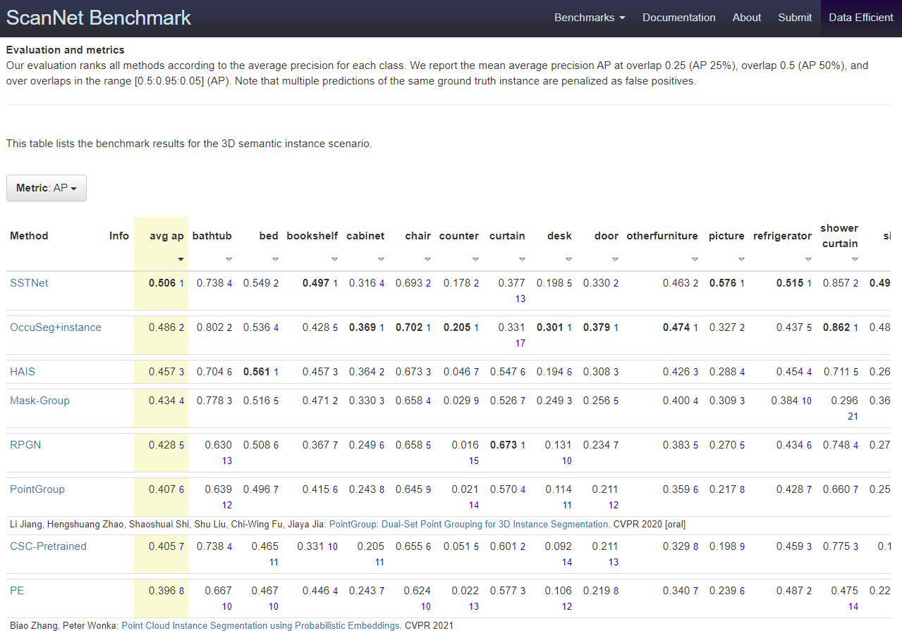

# SSTNet

**Instance Segmentation in 3D Scenes using Semantic Superpoint Tree Networks(ICCV2021)**
by Zhihao Liang, Zhihao Li, Songcen Xu, Mingkui Tan, Kui Jia*. (\*) Corresponding author.

## Results on ScanNet Benchmark
Rank 1st on the ScanNet benchmark

Code will be released soon

